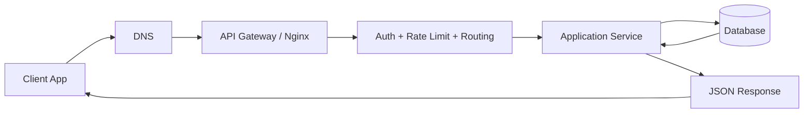

# Module 08: APIs and HTTP (Production-Grade Guide)

## Concept Overview
APIs (Application Programming Interfaces) are contracts that allow independent systems to communicate safely and predictably. In modern full-stack architecture, APIs sit between frontend clients (React, Next.js, mobile apps) and backend services (Spring Boot microservices), usually over HTTP(S) with JSON payloads.

This module teaches API design from beginner to production: protocol fundamentals, internals, performance engineering, security hardening, versioning, and operability.

## Why APIs Matter in Real Production
- Decouple frontend and backend release cycles.
- Enable multi-client support (web, mobile, partner integrations).
- Provide controlled access to business capabilities.
- Create observable and testable boundaries for distributed systems.

## Theory from Scratch

### 1) HTTP Fundamentals
- HTTP is an application-layer protocol following a request/response model.
- It is stateless by default: each request must contain all required context.
- HTTPS wraps HTTP in TLS for confidentiality and integrity.

### 2) Core Request Parts
- Method: `GET`, `POST`, `PUT`, `PATCH`, `DELETE`.
- URL: resource path + query params.
- Headers: metadata (`Authorization`, `Content-Type`, `Cache-Control`).
- Body: payload (typically JSON for `POST`/`PUT`/`PATCH`).

### 3) Response Parts
- Status code (`2xx`, `4xx`, `5xx`).
- Headers (`ETag`, `Retry-After`, `Content-Type`).
- Body (data or structured error object).

### 4) REST Design Principles
- Resources as nouns (`/users`, `/orders/{id}`).
- HTTP methods as verbs.
- Consistent representations and status code semantics.
- Predictable pagination/filter/sort conventions.

## Under the Hood: End-to-End Request Lifecycle

1. DNS resolves API domain to an IP address.
2. TCP connection is established; TLS handshake secures channel.
3. Client sends HTTP request with headers/body.
4. Reverse proxy/API gateway applies TLS termination, routing, throttling, auth checks.
5. Application layer validates payload and auth claims, executes business logic.
6. Data layer performs queries/transactions.
7. Response is serialized, compressed, returned to client.
8. Observability emits logs, metrics, traces for monitoring.

### Internal Flow Diagram (Mermaid)


## Production API Architecture Blueprint

```text
Client -> CDN/WAF -> API Gateway -> Service Layer -> Data Store
                         |               |
                         |               -> Cache (Redis)
                         -> Centralized Auth (JWT/OAuth)

Observability: Logs + Metrics + Traces across all layers
```

## Performance Considerations

### Latency and Throughput
- Keep p95/p99 latency targets for each endpoint.
- Avoid blocking operations in hot request paths.
- Use connection pooling and efficient serialization.

### Data Transfer Efficiency
- Use pagination for list endpoints.
- Use projection/field selection where relevant.
- Enable compression (`gzip`/`br`) for large payloads.

### Caching Strategy
- Client/browser caching with `Cache-Control`.
- Validation caching with `ETag` + `If-None-Match`.
- Edge caching through CDN for public content.
- Application caching for expensive computations.

### HTTP/2 and HTTP/3
- Multiplexing and better congestion handling can reduce head-of-line blocking and improve user-perceived performance.

## Security Considerations

### Authentication & Authorization
- Use short-lived access tokens and secure refresh flows.
- Validate JWT signature, issuer, audience, expiry.
- Enforce role/permission checks in service layer.

### Input and Payload Security
- Validate schema and constraints at API boundary.
- Reject unknown fields when needed.
- Enforce payload size limits and upload limits.

### Transport and Edge Security
- Enforce HTTPS everywhere and HSTS.
- Configure strict CORS allowlists.
- Apply rate limiting and abuse detection.
- Use WAF rules for common attack signatures.

### API Threats to Guard Against
- Broken authentication
- Excessive data exposure
- Injection attacks
- IDOR (Insecure Direct Object References)
- Misconfigured CORS

## Common Mistakes (and Fixes)
- Using action-like URLs (`/createUser`) instead of resource design (`POST /users`).
- Returning `200 OK` on business errors instead of proper 4xx/5xx semantics.
- Shipping inconsistent error formats across endpoints.
- No idempotency handling for payments/retries.
- Missing request correlation IDs, making incidents difficult to debug.

## Standard Error Response Format (Recommended)

```json
{
  "timestamp": "2026-02-28T11:05:00Z",
  "status": 400,
  "error": "Bad Request",
  "code": "VALIDATION_ERROR",
  "message": "email must be valid",
  "path": "/api/v1/users",
  "traceId": "f497f9ee7e8d47f2"
}
```

## Interview Questions

1. What is idempotency, and why is it critical for financial APIs?
2. Explain the difference between `PUT` and `PATCH` with practical examples.
3. What is CORS preflight, and when does a browser trigger it?
4. How do ETags reduce bandwidth and improve cache efficiency?
5. How would you version an API without breaking existing clients?
6. Compare REST and GraphQL for large frontend teams.
7. How would you design rate limiting for public APIs?
8. What metrics would you monitor for API reliability?

## Production-Level Best Practices
- Define API contracts using OpenAPI and publish docs automatically.
- Use semantic versioning and explicit deprecation policies.
- Add idempotency keys for non-repeat-safe operations.
- Enforce contract tests and integration tests in CI/CD.
- Use correlation IDs and distributed tracing (`traceId`) end-to-end.
- Track SLIs/SLOs (availability, latency, error rate) by endpoint.
- Apply zero-trust principles at service boundaries.

## Learning Tasks in This Module
- Build a REST API with pagination/filter/sort.
- Add JWT authentication and role-based authorization.
- Implement global exception handling and standard error format.
- Add Redis caching for a read-heavy endpoint.
- Add OpenAPI docs and contract tests.

## Module Folder Usage
- `01_code_examples`: endpoint design, DTO validation, pagination, caching examples.
- `02_practice_problems`: API refactoring and debugging exercises.
- `03_interview_questions`: scenario-based backend/API interview prep.
- `04_mini_project`: production-style API service with auth, docs, tests.
- `05_advanced_deep_dive`: API gateways, resilience patterns, and observability.

<!-- DOCS_UPGRADE_V2026_START -->
## Documentation Upgrade Layer

### Breadcrumb Navigation
[Home](../README.md) > 08_APIs_and_HTTP

### Internal Contents
- [Documentation Upgrade Layer](#documentation-upgrade-layer)
- [Conceptual Depth Model](#conceptual-depth-model)
- [Beginner Perspective](#beginner-perspective)
- [Intermediate Perspective](#intermediate-perspective)
- [Advanced Internal Working](#advanced-internal-working)
- [Under-the-Hood Architecture](#under-the-hood-architecture)
- [Real-World Use Cases](#real-world-use-cases)
- [Performance Considerations](#performance-considerations-upgrade)
- [Security Considerations](#security-considerations-upgrade)
- [Edge Cases and Limitations](#edge-cases-and-limitations)
- [Common Mistakes](#common-mistakes-upgrade)
- [Interview-Level Theory Questions](#interview-level-theory-questions-upgrade)
- [Production Best Practices](#production-best-practices-upgrade)
- [Folder Structure Diagram](#folder-structure-diagram-actual)
- [Examples Projects Advanced Production Map](#examples-projects-advanced-production-map)
- [Code References in Repository](#code-references-in-repository)
- [Cross-Module Links](#cross-module-links)
- [Navigation](#navigation)

### Conceptual Depth Model
This documentation extension preserves all existing module theory while adding architecture-level depth for `Module 08: APIs and HTTP (Production-Grade Guide)`. This README captures the module-level architecture narrative and practical learning progression. The dominant learning axis here is **API contract design and HTTP correctness**, with internal behavior centered on **request validation, routing, serialization, and error translation** and state/contracts centered on **versioned payload contracts and status semantics**.

For every major concept in this module, analyze it through this lens:
- **Definition:** what the concept is and the precise technical boundary it defines.
- **Why it exists:** the failure mode or engineering bottleneck it solves.
- **How it works internally:** state changes, control flow, data flow, runtime behavior, and system boundaries.
- **When to use it:** the context where this concept provides leverage.
- **When not to use it:** cost, complexity, coupling, and maintainability trade-offs.
- **Performance implications:** latency, throughput, memory, I/O, network, CPU, and scalability behavior.
- **Security implications:** trust boundaries, attack surface, data exposure risks, and mitigation patterns.
- **Real-world scenario:** a production context where the concept appears in a full-stack system.
- **Code reference in repository:** practical anchor points inside this repository.

### Beginner Perspective
- Start with observable behavior for **API contract design and HTTP correctness** before introducing abstractions.
- Track what inputs produce what outputs in **versioned payload contracts and status semantics** workflows.
- Use one example at a time and explain expected behavior before extending it.

### Intermediate Perspective
- Connect module outputs to neighboring layers and contracts impacted by **API contract design and HTTP correctness**.
- Analyze execution boundaries in **request validation, routing, serialization, and error translation** to find bottlenecks and race conditions.
- Compare implementation options using maintainability, operability, and migration cost.

### Advanced Internal Working
- Model normal-path and failure-path control flow for **request validation, routing, serialization, and error translation**.
- Specify invariants around **versioned payload contracts and status semantics** that must hold under scale and partial failure.
- Document rollback and recovery behavior before introducing optimization layers.

### Under-the-Hood Architecture
- Core execution model in this module: **request validation, routing, serialization, and error translation**.
- Primary state domain and contracts: **versioned payload contracts and status semantics**.
- Dominant architectural risk to isolate: **breaking API contracts and inconsistent error semantics**.

### Real-World Use Cases
- Build or migrate a system where **API contract design and HTTP correctness** is a critical delivery concern.
- Operate high-change environments where **request validation, routing, serialization, and error translation** behavior must stay predictable.
- Harden production paths where failures in **versioned payload contracts and status semantics** handling have business impact.

### Performance Considerations Upgrade
- Benchmark latency and throughput at boundaries affected by **request validation, routing, serialization, and error translation**.
- Reduce unnecessary work in **versioned payload contracts and status semantics** processing paths before micro-optimizations.
- Track p95/p99 under burst traffic and verify graceful degradation behavior.

### Security Considerations Upgrade
- Protect trust boundaries around **versioned payload contracts and status semantics** with strict validation and least privilege.
- Review abuse scenarios that exploit weak assumptions in **API contract design and HTTP correctness** flows.
- Add auditability for privileged operations and incident reconstruction.

### Edge Cases and Limitations
- Invalid input types, partial payloads, and schema drift across versions.
- Concurrency conflicts, race conditions, and eventual consistency gaps in distributed flows.
- Environment-specific behavior differences (local, CI, staging, production).

### Common Mistakes Upgrade
- Treating **request validation, routing, serialization, and error translation** behavior as deterministic without measuring it under load.
- Introducing abstractions before clarifying ownership of **versioned payload contracts and status semantics** boundaries.
- Ignoring **breaking API contracts and inconsistent error semantics** until late integration or production rollout.

### Interview-Level Theory Questions Upgrade
1. How would you define and enforce backward compatibility rules for request/response schemas so existing clients never break during incremental releases?
2. Compare API versioning approaches (URI versioning, header versioning, media-type versioning) and explain when each creates operational or adoption pain.
3. Walk through your strategy for idempotent write endpoints under retries and network timeouts, including key design, dedup windows, and storage trade-offs.
4. A critical endpoint shows rising 5xx and p99 latency. What is your investigation order across gateway limits, app validation paths, DB saturation, and downstream dependencies?
5. How do you design standardized error semantics so frontend and partner clients can reliably automate retries, user messaging, and incident triage?

### Production Best Practices Upgrade
- Maintain contract-first delivery using OpenAPI as the source of truth, and gate merges with schema diff checks for backward compatibility.
- Standardize request validation, error envelopes, and status-code policy across all endpoints to prevent drift between teams and services.
- Configure rate limits, timeout budgets, and retry guidance as part of API design docs, not after incident-driven firefighting.
- Require observability by default: correlation IDs, route-level SLIs, structured logs, and trace sampling tuned by endpoint criticality.
- Publish deprecation timelines, migration guides, and sunset headers early so clients can upgrade without emergency coordination.

### Folder Structure Diagram (Actual)
```text
08_APIs_and_HTTP/
├── 01_code_examples/
│   ├── express_api_with_validation.js
│   └── README.md
├── 02_practice_problems/
│   └── README.md
├── 03_interview_questions/
│   └── README.md
├── 04_mini_project/
│   └── README.md
├── 05_advanced_deep_dive/
│   └── README.md
├── advanced/
│   ├── 01_rate_limit_token_bucket.js
│   ├── 02_request_schema_guard.js
│   └── 03_api_version_negotiation.js
├── examples/
│   ├── 01_beginner_rest_routes.js
│   ├── 02_intermediate_pagination_filtering.js
│   └── 03_edge_case_etag_handling.js
├── production/
│   ├── 01_correlation_id_middleware.js
│   ├── 02_standard_error_envelope.js
│   └── 03_resilient_downstream_client.js
├── projects/
│   ├── 01_orders_api_mini_project.js
│   └── 02_users_api_with_roles.js
├── README.md
```

### Examples Projects Advanced Production Map
- [Examples](01_code_examples/README.md): foundational patterns and minimal reproducible implementations.
- [Projects](04_mini_project/README.md): integrated workflows with realistic constraints and trade-offs.
- [Advanced](05_advanced_deep_dive/README.md): deeper internals, system boundaries, and scaling-oriented decisions.
- [Production Architecture](../20_Production_Architecture/README.md): reliability, observability, and long-term operability principles.

### Code References in Repository
- This section is concept-first. Reference neighboring examples and projects in this module.

### Cross-Module Links
- [Root Roadmap](../README.md)
- [08_APIs_and_HTTP](README.md)
- [System Design](../11_System_Design/README.md)
- [Testing](../16_Testing/README.md)
- [Production Architecture](../20_Production_Architecture/README.md)

### Navigation
- **Previous Module:** [07_Java_Backend](../07_Java_Backend/README.md)
- **Next Module:** [09_Databases](../09_Databases/README.md)

<!-- DOCS_UPGRADE_V2026_END -->
